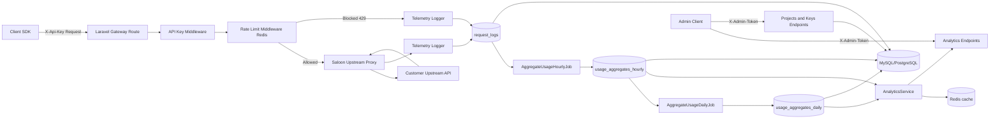

# Flowgate Architecture

Flowgate is built around a thin API gateway path and asynchronous analytics processing.

## System Diagram

## Request Path

1. Client hits `/api/g/{project}/{path?}` with `X-Api-Key`.
2. API key middleware resolves an active key for the target project.
3. Rate limiter checks and increments counters in Redis (or configured cache store).
4. Allowed traffic is proxied with Saloon to the project's upstream URL.
5. Request telemetry is recorded and queued for async processing.

## Analytics Path

1. Raw request logs are stored in `request_logs`.
2. Hourly jobs aggregate logs into `usage_aggregates_hourly`.
3. Daily jobs roll up hourly data into `usage_aggregates_daily`.
4. Analytics endpoints read aggregates and cache computed summaries.

## Components

- **HTTP Layer:** Controllers, middleware, Form Requests, API Resources
- **Domain Layer:** Flowgate services + DTOs
- **Integration Layer:** Saloon connector/request for upstream proxying
- **Async Layer:** Queue jobs + scheduled commands
- **Storage:** Redis (rate limit/cache), relational DB (source of truth)
